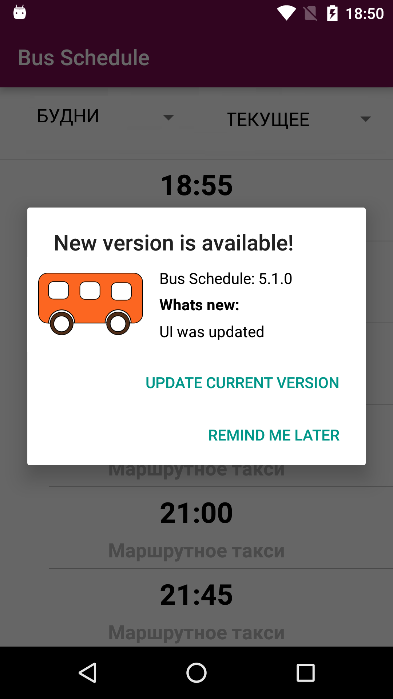

# GPVersionChecker
[](https://android-arsenal.com/details/1/3281)
<p>
Android Library for checking the current uploaded version on the Google Play
</p>

#Quick start

1) Just add this dependency into your build.gradle
```gradle
compile 'com.robohorse.gpversionchecker:gpversionchecker:1.0.9'
```

or

add it to your build.gradle with:
```gradle
allprojects {
    repositories {
        jcenter()
        maven { url "https://jitpack.io" }
    }
}
```
and:
```gradle
 compile 'com.github.robohorse:gpversionchecker:1.0.8'
```

2) Add 
```java 
  new GPVersionChecker.Builder(this).create();
```
into your Activity.java

```java
    @Override
    protected void onCreate(Bundle savedInstanceState) {
        super.onCreate(savedInstanceState);
        setContentView(R.layout.activity_main);
        
        new GPVersionChecker.Builder(this).create();
    }
```

Now you can see this awesome dialog window:
<p>

</p>

This library does not produce memory leaks - all context usages are leak-safe.

#Customization

<b>&#8226; Dialog window customization</b>

You can override string resource, that you want:
```xml
    <string name="app_name">GPVersionChecker</string>

    <string name="gpvch_header">New version is available!</string>
    <string name="gpvch_button_positive">Update current version</string>
    <string name="gpvch_button_negative">Remind me later</string>
    <string name="gpvch_new_version_info_title">Whats new:</string>
```
also, you can override dimensions for default dialog window
```xml
    <dimen name="gpvch_app_icon_margin">10dp</dimen>

    <dimen name="gpvch_tv_version_code_margin_left">5dp</dimen>
    <dimen name="gpvch_tv_version_code_margin_right">5dp</dimen>
    <dimen name="gpvch_tv_version_code_margin_top">10dp</dimen>

    <dimen name="gpvch_tv_header_whats_new">5dp</dimen>

    <dimen name="gpvch_tv_changes_margin_left">5dp</dimen>
    <dimen name="gpvch_tv_changes_margin_right">5dp</dimen>
    <dimen name="gpvch_tv_changes_margin_bottom">10dp</dimen>

    <integer name="gpvch_tv_changes_max_lines">4</integer>
```
image by overriding ```gpvch_app_icon.xml```
```xml
   <?xml version="1.0" encoding="utf-8"?>
   <bitmap xmlns:android="http://schemas.android.com/apk/res/android"
    android:src="@drawable/ic_launcher" />
```

or colors
```xml
    <color name="gpvch_dialog_text_color">@color/gpvch_black</color>
```

<b>&#8226; Version checking strategy</b>

Add this to builder, and dialog will be shown once in day
```java
.setCheckingStrategy(CheckingStrategy.ONE_PER_DAY)
```

<b>&#8226; Usage info response only</b>

The following code will block showing of the default dialog window, but gives information about current uploaded version
```java
 new GPVersionChecker.Builder(this)
                .setVersionInfoListener(new VersionInfoListener() {
                   
                    @Override
                    public void onResulted(Version version) {
                        
                    }
                })
                .create();
```

#ProGuard
Add the following to proguard-project.txt:

```gradle
-keep public class org.jsoup.** {
public *;
}
```

#About
Copyright 2016 Vadim Shchenev, and licensed under the MIT license. No attribution is necessary but it's very much appreciated. Star this project if you like it.
